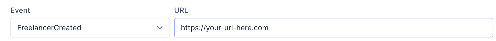

Recently, me and [my business partner](https://baselab.nl) wanted to do more with automation in our client projects. We got the chance to experiment with some no-code workflows using [Make](https://make.com). In Make we have some workflows running that are triggered by a webhook that is sent from the client's custom platform. When a workflow is triggered, it creates a new invoice or adds a new contact, depending on the actions configured in the workflow.

# What is a webhook?
Webhooks have been around for some while. They are used to notify other services when an event occurs in the service that has the webhook configured. The other services will be notified by the sending service via a HTTP request to the receiving service. For example, a webhook could be sent from [Trello](https://trello.com) when a card was moved to a different list.

# How to send webhooks from Laravel?
Sending a webhook from Laravel is not supported by default. You could use the Http facade and create an implementation yourself, however [Spatie](https://spatie.be) — they seem to have a package for everything Laravel related — maintains [a package on GitHub](https://github.com/spatie/laravel-webhook-server) that makes sending webhooks a breeze. It also supports signing calls, retrying calls and backoff strategies. Webhook calls are dispatched to the queue by default.

A webhook could be sent with the following code:
```php
WebhookCall::create()
   ->url('https://other-app.com/webhooks')
   ->payload(['key' => 'value'])
   ->useSecret('sign-using-this-secret')
   ->dispatch();
```

You could either hard code the URLs of the receiving services or create a page where your users can enter the URLs themselves like below.



Within the Laravel event system you could make a listener for every event you want a webhook to be called for. This works fine, however it quickly clutters your project when you have a lot of events a webhook needs to be called for. I struggled with this problem myself until a came up with a solution. It involves creating an interface and registering a dynamic listener using the `Event::listen` function in the `EventServiceProvider`.

First of all, I started with creating the interface which I placed in a newly created namespace called `App\Contracts`:
```php
<?php

namespace App\Contracts;

interface SendsWebhook
{
    public function webhookPayload(): array;
}
```
This interface will be implemented by all events I want a webhook to be called for. This has 2 advantages:
1. Every event class that implements the interface will have to implement the `webhookPayload` function which will be used as a parameter for the `payload` function on the `WebhookCall` facade.
2. We could use the interface to specify what events we want to listen for. This means we can listen for all events that call a webhook in one statement.

Now, instead of having separate listeners for every event I want to call a webhook for (due to different attributes existing on the different event classes) the only specific implementation I'll have to do is define what payload will be sent on the events that trigger a webhook. For example, an event is triggered when a new client was created. The payload will be defined as follows:
```php
public function webhookPayload(): array
{
    return array_merge(
        $this->client->toArray(),
        [
            'user' => $this->client->user->toArray()
        ]
    );
}
```
_It is important that the payload is formatted as an array in order for it to be JSON encoded_

While you still have to define the payload for every event, the amount of duplicate code between your listeners is greatly reduced as you only need to have one listener class:
```php
<?php

namespace App\Listeners;

use App\Contracts\SendsWebhook;
use App\Models\Webhook;
use Spatie\WebhookServer\WebhookCall;

class SendWebhook
{
    /**
     * Handle the event.
     *
     * @param SendsWebhook $event
     * @return void
     */
    public function handle(SendsWebhook $event)
    {
        $webhooks = Webhook::whereEvent(get_class($event))->get();
        foreach ($webhooks as $webhook) {
            WebhookCall::create()
                ->url($webhook->url)
                ->payload($event->webhookPayload())
                ->doNotSign()
                ->dispatch();
        }
    }
}
```
_In my case, I let users set their own webhooks which are saved in the database. Also, I choose not to sign my webhooks as this won't work with Make, but [you should sign your requests](https://github.com/spatie/laravel-webhook-server#how-signing-requests-works) when possible._

You might want to hard code the webhook URLs in which case you can add a config file like `webhooks.php` and specify the URLs like so:
```php
<?php

return [
    'urls' => [
        App\Events\UserCreated::class => 'https://your-url-here.com'
    ]
];
```

The `url` method on the `WebhookCall` facade can then be called as follows:
```php
WebhookCall::url(config('webhooks.urls.' . get_class($event)));
```

# Conclusion
With this article at its end, we've found out what webhooks are and how they can be used to make services work with other services when an event is triggered. In particular, we've discovered how events can be called from within our own Laravel projects and how you can easily implement webhooks without writing a separate listener for every event.

Feel free to to reach out to me on Twitter ([@julianquispel](https://twitter.com/julianquispel)) or [👋 send me a hello](mailto:hello@julianquispel.nl).

